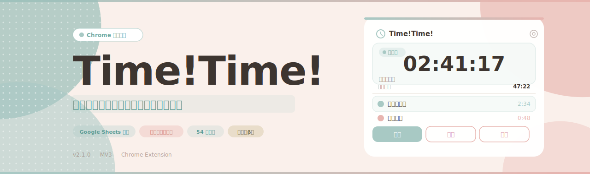

# Time!Time!

**クライアント別の稼働時間を、かわいく。スマートに。**

Chrome拡張機能（MV3）で動くタイムカードアプリ。複数クライアントの時間を記録し、Google スプレッドシートへ自動同期、請求書もその場で発行できます。β版・無料。

---

## 機能一覧

| カテゴリ | 機能 |
|----------|------|
| ⏱ タイマー | ワンクリックで開始/停止、メモ追加（任意・8秒） |
| 👤 クライアント管理 | 複数クライアントを色分けで管理 |
| 🏷 タグ | 作業種別をタグで分類 |
| 🍅 ポモドーロ | カスタム作業/休憩時間、チャイム通知 |
| 🎨 テーマ | 54種類のカラーテーマ |
| 📊 Google Sheets | スプレッドシートへ自動書き込み |
| 📅 Google Calendar | カレンダー連携・空き時間検索 |
| 🧾 請求書 | 月次請求書をブラウザから発行・印刷 |
| 📈 レポート | 週次・月次の稼働集計グラフ |
| 💬 Slack | 稼働開始/終了を自動投稿 |
| 💤 離席検知 | アイドル検知で自動一時停止 |

---

## インストール（β版 — 開発者モード）

1. このリポジトリから **Code → Download ZIP** でダウンロード
2. ZIPを解凍してフォルダを保存
3. Chrome アドレスバーに `chrome://extensions` を入力
4. 右上の **デベロッパーモード** をオン
5. **パッケージ化されていない拡張機能を読み込む** → 解凍したフォルダを選択
6. ツールバーの 📌 からピン留めして完成！

---

## 初期設定

1. 拡張機能アイコン右クリック → **オプション**
2. **基本情報** に自分の名前を入力（請求書のデフォルト名に使用）
3. **Google連携** で OAuth 認証（初回のみ）
4. スプレッドシートID・カレンダーIDを設定

---

## 技術スタック

- Chrome Extension Manifest V3
- Vanilla JS（フレームワークなし）
- Web Audio API（ポモドーロチャイム / Offscreen Document）
- Google Sheets API v4
- Google Calendar API v3
- Slack Incoming Webhooks

---

## ファイル構成

```
timecard-extension/
├── manifest.json
├── popup.html / popup.js / popup.css   # メインUI
├── settings.html / settings.js         # 設定画面
├── invoice.html / invoice.js           # 請求書
├── report.html / report.js             # レポート
├── background.js                       # Service Worker
├── offscreen.html / offscreen.js       # チャイム音声
├── lib/
│   ├── storage.js     # chrome.storage ラッパー
│   ├── sheets.js      # Google Sheets API
│   ├── calendar.js    # Google Calendar API
│   ├── slack.js       # Slack Webhook
│   ├── themes.js      # テーマ定義 54種
│   └── utils.js       # 汎用ユーティリティ
└── icons/
```

---

## ライセンス

個人利用・社内利用は自由にどうぞ。  
再配布・改変・商用利用はご連絡ください。

---

<sub>v2.1.0 — Chrome Extension MV3 — β版</sub>
